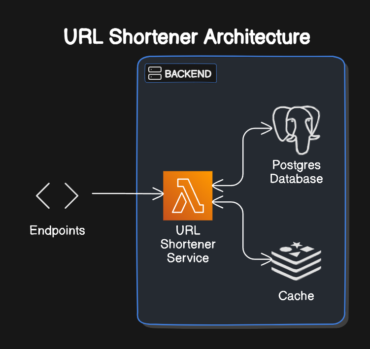

# Url Shortener

This is a simple URL shortener. It is a web application that allows users to enter a URL and get a shortened version of it. 
The shortened URL can be used to redirect to the original URL.

## Features
- Shorten a URL
- Redirect to the original URL using the shortened URL
- View the list of shortened URLs
- Cache the shortened URLs

## Architecture

## Technologies
- Entity Framework Core
- PostgreSQL
- Docker
- MemoryCache